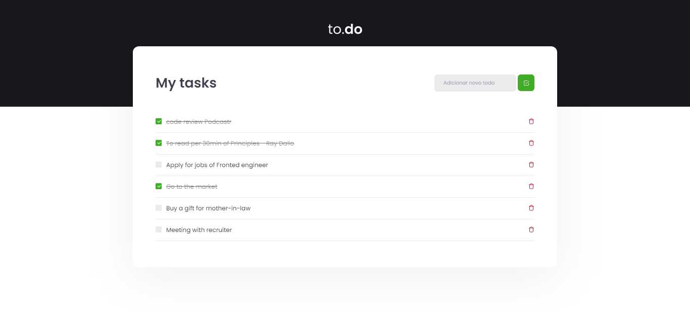

## 🚀 | Technologies

This project was developed with the following technologies:

- [React](https://reactjs.org)
- [TypeScript](https://www.typescriptlang.org/)

## 💻 | Project

Developed for challenge, i enjoyed the end result, made some changes only.
 

## 🔖 | Layout

  

## 💙 | Install and execute in your machine

_ps: If you need help for making a clone, this [tutorial](https://help.github.com/pt/github/creating-cloning-and-archiving-repositories/cloning-a-repository) help you.

1. Open the terminal of your computer. If yo're using Windows, must be the PowerShell. 
2. Change the current working directory to the location where you want the module code saved on your computer. 
3. Clone this repository by running:   `git clone https://github.com/soutovnc/taskList-app`;
4. Enter the folder running through the terminal: `cd taskList-app`;
5. Run `yarn` to install project dependencies;
6. Run `yarn dev` to start the development server.

### That's it, find me below.

